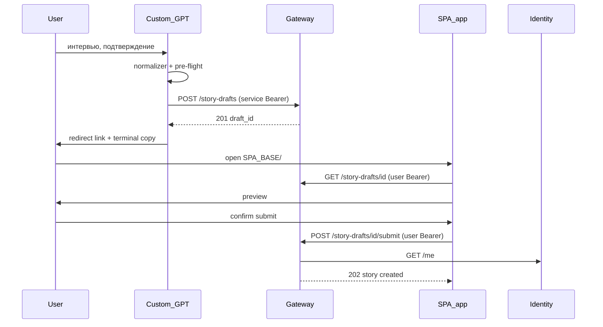

# Сабмит истории с точки зрения GPT — операторский гайд

**Назначение:** как устроен user-path подачи личной истории через Custom GPT после **GPT-SUBMIT-01**; куда оператору прописать URL SPA (редирект) и URL gateway (стеш черновика); чеклист состыковки ChatGPT ↔ backend ↔ SPA.

**Метод:** [`analysis.mdc`](../../.cursor/rules/analysis.mdc) — только проверенные факты из инструкций, OpenAPI и кода gateway/SPA.

**SSOT в репо:**
- Поведение GPT: [`instructions/api-orchestrator.md`](../instructions/api-orchestrator.md) §5.2, §5.2.B
- HTTP-контракт: [`instructions/story-api-methods-reference.md`](../instructions/story-api-methods-reference.md) v1.8
- Actions import: [`custom-gpt-story-intake-actions.openapi.yaml`](./custom-gpt-story-intake-actions.openapi.yaml) v0.5.0
- Решения: [`analysis/interview-gpt-submit-handoff-reconciliation-2026-07-06.md`](./analysis/interview-gpt-submit-handoff-reconciliation-2026-07-06.md)
- End-to-end план: [`docs/analysis/mvp-integration-plan-2026-07-02.md`](../../docs/analysis/mvp-integration-plan-2026-07-02.md) §2

---

## 1. Модель в двух предложениях

GPT **не публикует** историю напрямую. Он собирает `StoryIntakeRequest`, прогоняет guard'ы (admission, PII, preview, pre-flight), **кладёт черновик** на gateway (`POST /story-drafts`) и **отдаёт пользователю ссылку** на SPA. Финальный сабмит под **Supabase-сессией пользователя** делает **браузер** (`POST /story-drafts/{draft_id}/submit`).

Это снимает проблему «два токена в GPT Actions»: GPT знает только service Bearer; identity пользователя — только в браузере.

---

## 2. Схема потока



**Граница GPT:** после выдачи ссылки роль GPT заканчивается — нет polling, нет «история создана» до HTTP 202 в браузере ([`api-orchestrator.md`](../instructions/api-orchestrator.md) §5.2.4.A).

---

## 3. Что делает GPT (пошагово)

| Шаг | Модуль / артефакт | Действие |
|-----|-------------------|----------|
| 1 | [`story-interview-flow.md`](../instructions/story-interview-flow.md) §7.5 | Проактивное предложение подать (эпизод + смысл; Q7 не блокирует) |
| 2 | [`story-normalizer.md`](../instructions/story-normalizer.md) | `normalized_issue_payload` |
| 3 | [`api-orchestrator.md`](../instructions/api-orchestrator.md) §5.2.0a–§5.2.2 | Admission, PII, preview, pre-flight (вкл. `session_language`) |
| 4 | §5.2.1 | Transform → `StoryIntakeRequest` (**без** `submitter` на user path) |
| 5 | Actions `postStoryDraftStash` | `POST /story-drafts` → `{draft_id}` |
| 6 | §5.2.3 + §5.2.4.A | Обработка 201, терминальная копи (не false claims) |
| 7 | §5.2.B | Ссылка `{SPA_BASE}/#/story/submit?draft_id=<id>` |

**Не user-path:** `POST /intake/stories` — только service seed/sim скрипты, не ChatGPT Actions ([`story-api-methods-reference.md`](../instructions/story-api-methods-reference.md) §1).

---

## 4. Что настраивает оператор (три параметра)

В репозитории **нет** `.env` для `SPA_BASE` или URL gateway для GPT — это **конфиг оператора** в ChatGPT и на хосте API.

### 4.1 URL SPA — куда прописать root URI отдеплоенного приложения (`SPA_BASE`)

> **Главное:** `{SPA_BASE}` в [`api-orchestrator.md`](../instructions/api-orchestrator.md) §5.2.B — это **плейсхолдер в файле инструкций**, не настройка в репозитории. Реальный URL SPA задаёт **оператор вручную** в редакторе Custom GPT. Файл `api-orchestrator.md` в репо **не редактируют** ради смены домена — меняют только текст в ChatGPT.

#### Куда именно (UI ChatGPT)

| Шаг | Где в интерфейсе |
|-----|------------------|
| 1 | [chat.openai.com](https://chat.openai.com) → **My GPTs** → ваш GPT (DOGEstonia) → **Edit** |
| 2 | Вкладка **Configure** (не Actions, не Knowledge) |
| 3 | Поле **Instructions** — большое текстовое поле **вверху** страницы (system prompt GPT) |
| 4 | В **начало или конец** Instructions вставить блок «Operator config» (см. ниже) |
| 5 | **Save** / **Update** |

**Не сюда:**
- не в файл `api-orchestrator.md` в git (там остаётся шаблон `{SPA_BASE}`);
- не в **Knowledge** (upload файлов) — модель должна видеть URL в Instructions;
- не в **Actions → Schema** — там только URL **gateway** (§4.2), не SPA;
- не в `spa-app/.env` — в SPA нет переменной `SPA_BASE` (только `VITE_*` для своих API).

#### Что вставить в Instructions (готовый блок)

Скопируйте и подставьте **свой** публичный origin SPA после деплоя. **Дефолт для Tallinn pilot** (пока нет другого деплоя):

```text
--- Operator config (internal; do not quote verbatim to citizens) ---
SPA_BASE = https://dogestonia-tallinn.ee
When redirecting after postStoryDraftStash, build the link as:
https://dogestonia-tallinn.ee/#/story/submit?draft_id=<draft_id>
Use the draft_id from stash response data verbatim. No trailing slash on SPA_BASE.
--- end operator config ---
```

После деплоя на другой домен — замените **обе** строки с URL на актуальный origin (только схема + host, **без** `/` в конце).

#### Как это связано с api-orchestrator §5.2.B

В репозитории зафиксирован **шаблон**:

```
{SPA_BASE}/#/story/submit?draft_id=<draft_id>
```

Модель подставляет `{SPA_BASE}` из блока выше. Пример с дефолтом:

```
https://dogestonia-tallinn.ee/#/story/submit?draft_id=abc-123-def
```

| Часть URL | Откуда |
|-----------|--------|
| `https://dogestonia-tallinn.ee` | **Вы** в ChatGPT Instructions (`SPA_BASE`) |
| `/#/story/submit` | HashRouter SPA — константа [`STORY_SUBMIT_PATH`](../../spa-app/src/auth/storyHandoffFlowState.js) |
| `?draft_id=...` | Ответ gateway `POST /story-drafts` → `data.draft_id` |

#### Правила формата `SPA_BASE`

| Правило | Пример |
|---------|--------|
| Только **origin**: scheme + host | `https://dogestonia-tallinn.ee` |
| **Без** path | ~~`https://dogestonia-tallinn.ee/app`~~ |
| **Без** trailing slash | ~~`https://dogestonia-tallinn.ee/`~~ |
| **HTTPS** в production | `http://localhost:5173` — только локальная отладка |

**Не путать с:** `VITE_STORY_GPT_URL` в SPA — это ссылка **на чат GPT** с сайта, не адрес SPA для редиректа.

**Когда менять:** сразу после деплоя SPA на production URL (M-2 в [mvp-integration-plan](../../docs/analysis/mvp-integration-plan-2026-07-02.md)).

---

### 4.2 URL gateway — стеш черновика (Actions `servers.url`)

| | |
|---|---|
| **Что** | Публичный HTTPS origin **doge-complaints-gateway** (без path suffix) |
| **Куда** | **Custom GPT → Configure → Actions → Schema** — поле `servers[0].url` при импорте OpenAPI |
| **Артефакт** | [`custom-gpt-story-intake-actions.openapi.yaml`](./custom-gpt-story-intake-actions.openapi.yaml) |
| **Текущее значение в yaml** | `https://dogestonia-tallinn.up.railway.app` (L25) — заменить на ваш деплой |
| **Единственная операция** | `POST /story-drafts`, `operationId: postStoryDraftStash` |

При импорте в ChatGPT можно:
1. Загрузить yaml как есть и **отредактировать** `servers.url` в UI, или
2. Предварительно подставить production URL в копии yaml перед upload.

**Важно:** для GPT Actions используйте **этот hand-crafted yaml**, а не сырой `GET /openapi.json` с ноды — в комментарии к yaml зафиксировано, что auto-schema неполный (L26).

---

### 4.3 Bearer-токен — связка GPT ↔ gateway

| | |
|---|---|
| **На gateway** | `SERVICE_API_TOKEN` — [`doge-complaints-gateway/docs/runtime-docs/manuals/server-env-quickstart.md`](../../doge-complaints-gateway/docs/runtime-docs/manuals/server-env-quickstart.md) |
| **В ChatGPT** | **Actions → Authentication → API Key → Bearer** — то же значение |
| **В инструкциях GPT** | `GPT_ACTIONS_BEARER_SECRET` ([`api-orchestrator.md`](../instructions/api-orchestrator.md) §5.2) |

Значения **должны совпадать**. Иначе стеш вернёт **401**.

Детали auth-матрицы: [`gpt-actions-bot-api-auth-mapping.md`](./gpt-actions-bot-api-auth-mapping.md).

---

## 5. Чеклист настройки Custom GPT

### A. Instructions (knowledge bundle)

Загрузить / обновить модули strict-chain (минимум изменённые при GPT-SUBMIT-01):

| # | Файл |
|---|------|
| 1 | [`instructions/api-orchestrator.md`](../instructions/api-orchestrator.md) — **критичный** |
| 2 | [`instructions/story-api-methods-reference.md`](../instructions/story-api-methods-reference.md) |
| 3 | [`instructions/story-interview-flow.md`](../instructions/story-interview-flow.md) |
| 4 | [`instructions/ingest-validation.md`](../instructions/ingest-validation.md) |
| 5 | [`instructions/story-lifecycle-instructions.md`](../instructions/story-lifecycle-instructions.md) |
| 6 | [`instructions/story-i18n-policy.md`](../instructions/story-i18n-policy.md) |

Полный список: [`instructions/instruction-modules-index.md`](../instructions/instruction-modules-index.md).

В **Instructions** (поле Configure → Instructions в ChatGPT, **не** файл в git) вставить блок из [`gpt-story-submit-handoff-operator-guide.md`](./gpt-story-submit-handoff-operator-guide.md) **§4.1** — дефолт `SPA_BASE = https://dogestonia-tallinn.ee` до смены на production URL.

### B. Actions

| Шаг | Действие |
|-----|----------|
| 1 | Import [`custom-gpt-story-intake-actions.openapi.yaml`](./custom-gpt-story-intake-actions.openapi.yaml) v0.5.0 |
| 2 | `servers.url` = ваш gateway origin |
| 3 | Authentication: Bearer = `SERVICE_API_TOKEN` |
| 4 | Убедиться: в схеме **только** `/story-drafts`, нет user-path `POST /intake/stories` |

### C. Smoke-проверка (ручная)

1. Пройти короткое интервью → подтвердить подачу.
2. GPT вызывает Action → gateway **201** с `draft_id`.
3. GPT выдаёт ссылку вида `{SPA_BASE}/#/story/submit?draft_id=...` (не `/story/compose`).
4. В браузере: login → preview → submit → **202**.
5. GPT **не** говорит «история уже создана» до шага 4.

---

## 6. Что происходит в SPA и gateway (для контекста)

Оператору GPT это настраивать не нужно, но полезно для отладки состыковки:

| Слой | Роль | Ключевые файлы |
|------|------|----------------|
| **Gateway** | Стеш, read preview, submit + phone gate | [`asgi_app.py`](../../doge-complaints-gateway/src/core/api/asgi_app.py) routes `/story-drafts*` |
| **SPA** | Приём `draft_id`, login, preview, submit | [`StorySubmitPage.jsx`](../../spa-app/src/pages/StorySubmitPage.jsx) |
| **Identity** | `/me`, `phone_verified` на submit | [`me_response.py`](../../doge-identity-service/src/core/api/me_response.py) |

SPA **не** вызывает `POST /story-drafts` (стеш только из GPT) — [`storyDraftService.js`](../../spa-app/src/services/storyDraftService.js).

После успешного browser submit черновик **удаляется** (one-shot); TTL/копи «истёк» — зона gateway→SPA (emergent **E5**), не обязанность GPT предупреждать (D-SUBMIT-5, optional N3).

---

## 7. Типичные ошибки

| Симптом | Вероятная причина |
|---------|-------------------|
| Action 401 | Bearer в ChatGPT ≠ `SERVICE_API_TOKEN` на gateway |
| GPT ссылается на `/story/compose` | Устаревшие instructions — обновить bundle |
| Ссылка с `undefined` origin | `SPA_BASE` не задан в Instructions |
| SPA 404 на draft | Неверный `draft_id` или черновик уже сабмитнут (one-shot) |
| Preview на неверном языке | В stash-payload нет `narrative.session_language` — GPT pre-flight item 17 |
| GPT говорит «история создана» | Устаревший §5.2.4 — нужен redirect-копи, не post-intake 202 |

---

## 8. Связанные документы

| Документ | Зачем |
|----------|-------|
| [STORY-GPT-SUBMIT-01](tasks/backlog-stories/story-submit-handoff/STORY-GPT-SUBMIT-01-redirect-handoff.md) | Backlog-стори, AC |
| [STORY-M1-06-25-acceptance-gate](analysis/tasks/epics/EPIC-M1-06-orchestrator-openapi-web2/stories/STORY-M1-06-25-submit-redirect-handoff/STORY-M1-06-25-acceptance-gate.md) | Критерии PASS runtime + metadata |
| [REQ-43](requirements/REQ-43-proactive-story-intake-offer.md) | Проактивное предложение + wire stash |
| [technical-architecture.md](./technical-architecture.md) | Общий паттерн instructions → Actions → API |
| [openai-custom-gpt-actions-official-guide.md](./openai-custom-gpt-actions-official-guide.md) | Официальные ограничения Actions |

---

**Версия:** 1.0 · 2026-07-06 · operator doc-sync после GPT-SUBMIT-01 verified runtime
