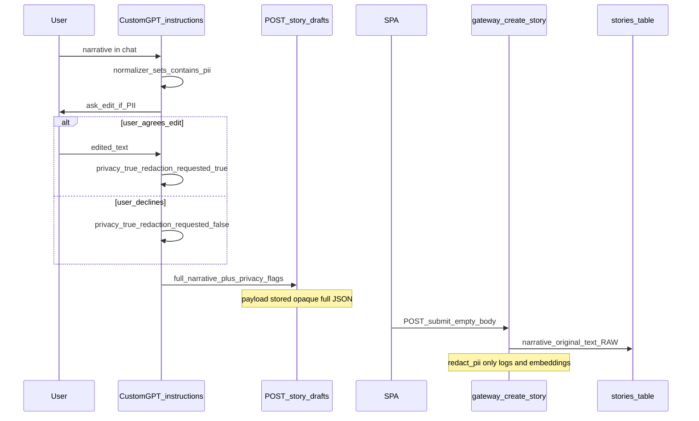

# Обработка PII в story-path: детект, pre-send и сервер (as-built / GDPR)

> **Назначение:** персистентная фиксация **фактов с диска** о том, как в контуре Custom GPT → stash → SPA submit → gateway обрабатываются персональные данные (PII) в тексте истории: что считается PII, есть ли очистка *перед* отправкой на сервер, что реально пишется в БД, где применяется `redact_pii`, где только флаги.
> **Метод:** [`.cursor/rules/analysis.mdc`](../../../.cursor/rules/analysis.mdc) — только проверяемые утверждения со ссылками на инструкции / OpenAPI / `src` / SPA; где поведения нет — явно «в коде нет».
> **Сверка с кодом:** 2026-09-01 (после GPT-SSR-03 / GIM-274: `geo_detail` в PII scan set).
> **Не является** юридическим заключением, RoPA или заменой DPA с OpenAI / хостинг-провайдерами; описывает as-built processing для controller view и копирования в privacy-политики.

Смежный контур телефона (отдельный controller path): [`doge-identity-service/docs/runtime-docs/10-phone-personal-data-processing.md`](../../../doge-identity-service/docs/runtime-docs/10-phone-personal-data-processing.md). Persistence stories: [`doge-complaints-gateway/docs/runtime-docs/story-persistence-model.md`](../../../doge-complaints-gateway/docs/runtime-docs/story-persistence-model.md). Schema pack / custom model: [`schema-pack-custom-model-operator-manual-ru.md`](./schema-pack-custom-model-operator-manual-ru.md).

---

## 1. Термины

| Термин | Значение в этом документе |
|--------|---------------------------|
| **PII** | Personally identifiable information — данные, по которым можно идентифицировать человека (имя, адрес, телефон, email, personal ID). В продуктовых инструкциях и REQ используется именно «PII». |
| **Очистка / cleansing** | Удаление или маскирование PII из текста **до** или **вместо** persist. |
| **Редактура (user-driven)** | Пользователь соглашается править нарратив в чате GPT; GPT помогает переписать текст (instruction-layer, best-effort LLM). |
| **Флаг `privacy.*`** | Wire-поля `contains_pii` / `redaction_requested` — метаданные, не scrub текста. |
| **`redact_pii` (gateway)** | Замена всего переданного фрагмента на `[REDACTED]`, если флаг `contains_pii` true — **не** точечный strip по типам. |

---

## 2. Категории данных в story-path

| Категория | Форма | Где | Статус в коде / инструкциях |
|-----------|--------|-----|------------------------------|
| Текст эпизода | plaintext `narrative.original_text` | stash payload → `stories.narrative_original_text` | **персистится как есть**; серверного scrub **нет** |
| Title / description / summary | plaintext i18n `{et,ru,en}` | stash → story columns | **персистятся как есть** |
| `privacy.contains_pii` | boolean | wire → `privacy_contains_pii` | персистентный флаг; default `false` |
| `privacy.redaction_requested` | boolean | wire → `privacy_redaction_requested` | персистентный флаг; **не** запускает scrub в `src/` |
| Taxonomy `pii_present` / `redaction_needed` | internal labels | GPT taxonomy / optional wire taxonomy | instruction metadata; не scrub |
| `geo_detail` address / label | plaintext street/house/`normalized_label` | optional root sidecar | **в PII scan set** orchestrator §5.2.0 + item 19 (GIM-274); персист как часть stash payload |
| Автор | opaque `submitter_external_user_id` + issuer | browser submit + identity introspection | не содержимое нарратива |
| Диалог ChatGPT | plaintext chat | процессор OpenAI (вне gateway) | вне кода DOGEstonia; gateway не контролирует |

Инструкция data-model:

```100:102:GPT UI/instructions/story-data-model.md
## 6. PII and safety

Do not collect PII by default; do not store personal data in Issue content beyond operator policy.
```

---

## 3. Что инструкции называют PII

Источник SSOT детекта на стороне GPT: [`story-normalizer.md`](../../instructions/story-normalizer.md) §4.4 (REQ-23 §1.2):

```362:380:GPT UI/instructions/story-normalizer.md
### 4.4 PII detection (REQ-23 §1.2)

Scan `canonical_payload.description.*` and narrative text used for `original_text` mapping for personally identifiable information:

| PII type | Examples |
|----------|----------|
| Person name | «Иван Петров», «Mari Tamm» |
| Address | «Liivalaia 10-5», street + number |
| Phone | `+372…`, national formats |
| Email | `name@domain` |
| Personal identifier | ID-card, passport, national ID numbers |

**Rules:**

- If **high confidence** that any type is present → set `normalization_metadata.contains_pii = true`.
- If **low confidence** → still set `contains_pii = true` (conservative).
- If no PII detected → `contains_pii = false`.

Do **not** perform the user interaction here; [`api-orchestrator.md`](api-orchestrator.md) §5.2.0 runs the two-step edit flow before HTTP.
```

Internal taxonomy keys (не публичные canonical labels): `pii_present`, `redaction_needed` в pack `taxonomy.json` / archive snapshot (ось `risk_privacy_safety`; GPT-SSR-10).

Wire-схема Privacy:

```223:231:GPT UI/docs/custom-gpt-story-intake-actions.openapi.yaml
    Privacy:
      type: object
      properties:
        contains_pii:
          type: boolean
          default: false
        redaction_requested:
          type: boolean
          default: false
```

Parse на gateway (defaults `false`, без эвристик по тексту):

```372:381:doge-complaints-gateway/src/core/intake/contracts.py
        contains_pii = _optional_bool(
            privacy_payload, "contains_pii", parent="privacy"
        )
        redaction_requested = _optional_bool(
            privacy_payload, "redaction_requested", parent="privacy"
        )
        ...
            contains_pii=contains_pii if contains_pii is not None else False,
            redaction_requested=(
                redaction_requested if redaction_requested is not None else False
```

---

## 4. Пайплайн: до и после send



Порядок guards в orchestrator (stash path): admission §5.2.0a → PII §5.2.0 → dual-mode preview §5.2.0b → pre-flight §5.2.2 → HTTP `postStoryDraftStash` ([`api-orchestrator.md`](../../instructions/api-orchestrator.md)).

---

## 5. Слой GPT (instruction-only): pre-send

Единственный продуктовый «cleansing before send» — **не машинный scrub**, а диалог с пользователем:

```437:448:GPT UI/instructions/api-orchestrator.md
#### 5.2.0 PII pre-send check (REQ-23 §1.3)
...
If `normalization_metadata.contains_pii` is `true`:

1. **Inform the user** which PII type(s) were detected in `original_text` / `description.*` and ask whether they want to remove them before submission.
2. **If the user agrees to edit:** help edit the narrative, re-run [`story-normalizer.md`](story-normalizer.md) on the edited text, then set `privacy.contains_pii = true` and `privacy.redaction_requested = true`.
3. **If the user declines:** set `privacy.contains_pii = true` and `privacy.redaction_requested = false`.
4. Proceed to §5.2.0b dual-mode preview, then §5.2.2 pre-flight.

If `contains_pii` is `false` or absent: **omit** the entire `privacy` block; proceed to §5.2.0b dual-mode preview, then §5.2.2.
```

**Scan set (as-built GPT-SSR-03 / GIM-274):** narrative wire text **и** text sidecars (`consistency_notes`, `location_query`, …) **и** `geo_detail` text — `address.street`, `address.house` / `house_range` / `houses[]`, `normalized_label` — когда `geo_detail` присутствует ([`api-orchestrator.md`](../../instructions/api-orchestrator.md) §5.2.0 scan set + item 19 re-scan immediately before HTTP). Opaque submitter / HMAC / identity ids **не** narrative PII.

Следствия (as-built):

| Сценарий | Текст на wire | Флаги |
|----------|---------------|-------|
| PII не детектирован | полный текст | блок `privacy` опущен → сервер default false |
| PII + user согласен править | текст **после** ручной/LLM-редактуры (гарантии scrub **нет**) | `contains_pii=true`, `redaction_requested=true` |
| PII + user отказался | **полный текст с PII** | `contains_pii=true`, `redaction_requested=false` |

God Mode preview: **No redaction** полного draft JSON:

```513:513:GPT UI/instructions/api-orchestrator.md
**Zero simplification (REQ-31 §2.4):** show the **full** draft `StoryDraftStashRequest` (and mapping notes) exactly as built for HTTP — including `schema_version`, `narrative` (**with `narrative.taxonomy` per-axis block when present — GPT-TAX-01 / T04**), `gpt_signals`, `origin`, `privacy`, `live_story_context`, labels, severity, and transport fields. Use a JSON block when helpful. **No** redaction, **no** citizen-style abstraction in this mode.
```

GPT Actions (OpenAPI): единственный Action для story — `POST /story-drafts` с полным `narrative` (+ optional `privacy`). Блок `submitter` на этом шаге не отправляется (browser submit).

---

## 6. Слой Gateway (runtime): что происходит с текстом

### 6.1 Stash хранит полный payload

```537:539:doge-complaints-gateway/src/core/api/handlers.py
        record = StoryDraftRecord(
            draft_id=draft_id,
            payload=stash.as_dict(),
```

### 6.2 Persist story — raw narrative

```236:239:doge-complaints-gateway/src/core/application/services.py
            record = StoryRecord(
                story_id=story_id,
                schema_version=request.schema_version,
                narrative_original_text=request.narrative.original_text,
```

Флаги privacy пишутся рядом (`privacy_contains_pii`, `privacy_redaction_requested`) — см. тот же `create_story` (~L276–279).

### 6.3 `redact_pii` — только при флаге, целиком placeholder

```5:10:doge-complaints-gateway/src/core/redaction.py
def redact_pii(text: str, contains_pii: bool) -> str:
    """Return redacted placeholder when PII flag is set (REQ-37 §2.2)."""
    if contains_pii:
        return PII_REDACTED
    return text
```

Использование:

1. **Лог preview** (первые 50 символов → redact если флаг):

```152:157:doge-complaints-gateway/src/core/application/services.py
        contains_pii = (
            request.privacy.contains_pii if request.privacy is not None else False
        )
        text_preview = redact_pii(
            request.narrative.original_text.strip()[:50], contains_pii
        )
```

2. **Источник эмбеддинга** (если `privacy_contains_pii` на сохранённой story):

```546:550:doge-complaints-gateway/src/core/application/services.py
def _canonical_story_embedding_source(story: StoryRecord) -> str:
    labels = ",".join(story.narrative_canonical_labels)
    redacted_text = redact_pii(
        story.narrative_original_text.strip(), story.privacy_contains_pii
    )
```

**В коде нет:** точечного regex/NER scrub по телефонам/email; применения `redact_pii` к `narrative_original_text` перед INSERT; обработки `redaction_requested=true` как триггера контент-редактуры.

REQ-23 явно выносит серверную контент-редактуру из scope:

```215:217:GPT UI/docs/requirements/REQ-23-gpt-behavioral-extensions-pii-signals-consistency.md
## 5. Не в scope этого REQ

- Серверная обработка `redaction_requested = true` (контент-редактура, REQ-31)
```

Поиск по gateway `src/` на `detect_pii`, `INTAKE_NOT_SUBSTANTIVE`, `WITHDRAWN`, `data_notice`: **0 matches** (сверка 2026-08-10).

### 6.4 Downstream без scrub

При агрегации для issue promote используется raw `narrative_original_text`:

```149:154:doge-complaints-gateway/src/core/application/issue_create.py
        narrative_chunks = [
            story.narrative_original_text.strip()
            for story in stories
            if story.narrative_original_text.strip()
        ]
        aggregate_text = " ".join(narrative_chunks) if narrative_chunks else promoted_title
```

---

## 7. SPA

Submit: `POST /story-drafts/{id}/submit` с телом `{}` — **нет** клиентского redact:

```183:191:spa-app/src/services/storyDraftService.js
      return normalizeSubmitResult(
        await gatewayFetch(
          baseUrl,
          `/story-drafts/${encodeURIComponent(draftId)}/submit`,
          {
            method: 'POST',
            token,
            body: JSON.stringify({}),
          },
        ),
      )
```

UX-копирайт (не enforcement): `Avoid sharing unnecessary personal data` в [`howItWorksDictionary.js`](../../../spa-app/src/i18n/howItWorksDictionary.js) (~L37).

---

## 8. Identity (смежный контур)

Телефон / OTP / IP hashing — **не** часть story body. As-built: [`10-phone-personal-data-processing.md`](../../../doge-identity-service/docs/runtime-docs/10-phone-personal-data-processing.md). Связь со story — opaque submitter id при browser submit, не scrub нарратива.

---

## 9. Gaps / риски (verified)

| Риск | Факт с диска |
|------|----------------|
| Нет серверной перепроверки PII | Gateway доверяет флагу / default `false`; текста не сканирует |
| LLM miss / omit `privacy` | Текст с PII может уйти с `contains_pii=false` |
| User declines edit | Полный текст с PII + флаги true/false в БД |
| «Agree to edit» | Нет машинной гарантии удаления всех PII — только re-run normalizer после диалога |
| `redaction_requested` | Persist flag only; контент-редактура на сервере **в src нет** |
| Stash TTL draft | Полный JSON до submit / expiry |
| God Mode | Preview без redaction |
| OpenAI chat | Весь диалог виден процессору чата вне gateway |
| REQ-31 heuristic / citizen delete | Спеки/требования; runtime `detect_pii_heuristic` / delete path **в gateway src нет** |
| Issue promote | Берёт raw narrative chunks |

---

## 10. Implemented vs Planned

| Тема | Current (as-built) | Planned / Deferred (док, не код) | Evidence |
|------|--------------------|----------------------------------|----------|
| PII detect + ask user | GPT instructions §4.4 + §5.2.0 | — | `story-normalizer.md`, `api-orchestrator.md` |
| Wire `privacy.*` | OpenAPI + parse + DB columns | — | OpenAPI Privacy; `contracts.py`; `StoryRecord` |
| Server content redaction | **Нет** | REQ-23 §5 → REQ-31 | REQ-23; нет handler scrub |
| Log / embedding redact | `redact_pii` if flag | — | `redaction.py`, `services.py` |
| Heuristic detect / delete / vault | **Нет в src** | REQ-21 vault (Deferred), gateway citizen-data-rights specs | grep 0; REQ-21 dashboard Deferred |

---

## 11. Вердикт для юридики (одна фраза)

**Автоматической очистки PII из текста истории перед записью на сервер в runtime нет.** Есть instruction-layer детект и опциональная пользовательская редактура, wire-флаги, и серверная подмена preview/эмбеддинга на `[REDACTED]` **только если** клиент выставил `contains_pii=true`; полный `narrative.original_text` при этом остаётся в stash и в таблице stories.

---

## 12. Сверка

| Поле | Значение |
|------|----------|
| Дата | 2026-09-01 |
| Метод | analysis.mdc |
| Репозитории | GPT UI instructions + OpenAPI; doge-complaints-gateway `src/core`; spa-app `storyDraftService.js` |
| SSR note | `geo_detail` в PII scan set (orchestrator 0.5.9 / GIM-274) |
