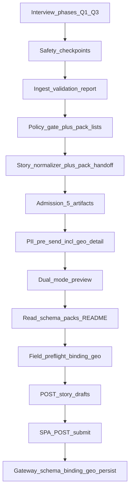

# Валидация историй и фильтрация «мусора» (as-built / GDPR + product)

> **Назначение:** персистентная фиксация **фактов с диска** о критериях допуска истории (story / civic narrative) к stash и persist: как GPT-инструкции отличают пригодный civic signal от off-topic / spam / test junk; что реально режет gateway HTTP; что является «не мусором» as-built.
> **Метод:** [`.cursor/rules/analysis.mdc`](../../../.cursor/rules/analysis.mdc) — только проверяемые утверждения; где enforcement отсутствует — явно «в коде нет» / «только instruction-layer».
> **Сверка с кодом:** 2026-09-01 (после GPT-SSR-01…03 + gaps GIM-273…276 CLOSED).
> **Не является** юридическим заключением о lawful basis moderation; описывает as-built quality / admission gates для controller и product/compliance review.

Парный документ по PII: [`story-pii-processing-before-send-as-built.md`](./story-pii-processing-before-send-as-built.md).  
Операторский мануал swap модели/валидации: [`schema-pack-custom-model-operator-manual-ru.md`](./schema-pack-custom-model-operator-manual-ru.md).

---

## 1. Термины и вердикт

| Термин | Где встречается | Значение |
|--------|-----------------|----------|
| **Мусор / junk / test** | [`api-orchestrator.md`](../../instructions/api-orchestrator.md) §5.2.0a test/sandbox rule | Тестовые или «мусорные» записи **не** должны идти в production stash |
| **Not garbage / не мусор** | — | **Явного acceptance-критерия с этой формулировкой в коде/инструкциях нет** |
| **Recognizably civic** | [`story-policy-gate.md`](../../instructions/story-policy-gate.md) §7.1 + pack inbound domain lists | Ближайшее явное определение `approved` |
| **Substantive civic issue** | REQ-30 SHOULD server code `INTAKE_NOT_SUBSTANTIVE` | Задокументировано как SHOULD; **в gateway `src/` нет** |
| **Schema pack** | [`schema-packs/README.md`](../../instructions/schema-packs/README.md) | Два сменных overlay: `data-model.md` + `inbound-validation.md` под active pair |
| **`schema_binding`** | OpenAPI 0.8.0; orchestrator §5.2.1 / item 20; gateway `contracts.py` | Обязательный root sidecar: semantic pair + `structured_payload` |
| **`geo_intake.mode`** | pack data-model §3 | `optional` / `require_location_or_detail` / `require_detail` — gate geo emit |

**Вердикт:** содержательный фильтр «мусора» и civic relevance живёт почти целиком в **Custom GPT instructions** (interview → safety → ingest validation → policy gate → admission + **pack inbound lists**). Gateway принимает схематически валидный envelope **включая required `schema_binding`** и payload shape; **substantive / spam / vocabulary labels на сервере не режутся**.
---

## 2. Порядок pipeline

Инженерная цепочка (после narrative readiness):

```41:51:GPT UI/instructions/story-lifecycle-instructions.md
### 2.1 Mandatory Issue strict-chain order
...
1. **Ingest validation** — `ingest_validation_report`; ...
2. **Safety & compliance** — `safety_compliance_report` ...
3. **[`story-policy-gate.md`](story-policy-gate.md)** — ... `policy_gate_result`; **no API**.
4. **Issue normalization** — ... `normalized_issue_payload`.
5. **API orchestrator** — HTTP only here.

**Normative shorthand:** **validation → safety → policy gate → normalization → API**.
```

Расширение на Module 2 stash (orchestrator):



Перед stash orchestrator **читает** active pair из [`schema-packs/README.md`](../../instructions/schema-packs/README.md), заполняет `schema_binding.structured_payload` / geo по pack `geo_intake.mode`, затем pre-flight items 13/20 ([`api-orchestrator.md`](../../instructions/api-orchestrator.md) §5.2.1).

Между шагами действует stop-the-line: при block validation/safety/gate — **не** идти в normalizer/API ([`story-lifecycle-instructions.md`](../../instructions/story-lifecycle-instructions.md) §2).
---

## 3. Критерии «достаточно истории» (interview)

### 3.1 Семь вопросов completeness

```72:82:GPT UI/instructions/story-interview-flow.md
| # | Question (completeness) | Typical coverage (dialogue phases) | Blocking for Phase 7 / intake? |
|---|-------------------------|----------------------------------|--------------------------------|
| 1 | What happened or keeps happening? | Phase **2** | **Yes** |
| 2 | Where does it happen? | Phase **2** | **Yes** |
| 3 | Who or what is affected? | Phases **2–3** | **Yes** |
| 4 | Why does it matter to the user? | Phase **3** | **Yes** (for full depth; see **§7.5** — episode + meaning may suffice for proactive offer) |
| 5 | What is the **deep unmet** need? | Phase **4** | **Optional** for personal-story intake (deepen if user wants) |
| 6 | What does the **desired state** look like? | Phase **5** | **Optional** for personal-story intake (deepen if user wants) |
| 7 | Is there evidence this is **not a one-off**? (one-off vs recurring) | Phase **6** | **No** — optional signal only; personal story valid without it |
```

**Минимум для personal-story intake:** Q1–Q3 (эпизод + затронутые); Q7 **не** блокирует. Это soft gate instruction-layer — HTTP сервер этих вопросов не знает.

### 3.2 Глубина слоёв

```49:56:GPT UI/instructions/story-interview-flow.md
User utterances stack **four layers** (psychological model §6.1). The model must **guide at least to layer 3** ...
| **3** | Emotional | “It drains me / angers me / feels unfair.” | **Minimum depth** before treating narrative as mature. |
```

### 3.3 Quality bar («good enough») — внутренний QA, не HTTP reject

```252:263:GPT UI/instructions/story-interview-flow.md
## 9. Quality bar — “good enough” interview

High quality is **not** maximum transcript length. Use this **internal QA** before treating a turn or Phase 7 block as strong:

1. **Understood:** ...
2. **Clearer than at start:** ...
3. **Deep need visible:** ...
4. **Desired state articulated:** ...
5. **Civic hook:** ... **not** required for personal-story intake ...
6. **Downstream-usable:** ...
```

Продуктовое зеркало: [`REQ-13-quality-criteria.md`](../requirements/REQ-13-quality-criteria.md) (без машинных порогов в коде).

### 3.4 Structural §4.1 (перед API)

```52:60:GPT UI/instructions/story-data-model.md
### 4.1 Required for logical Issue after interview (before API)

| Field | Type (logical) | Rule |
|-------|----------------|------|
| `type` | string enum | One of `ISSUE_TYPE`: `complaint`, `observation`, `absurdity`, `system_bug`. |
| `labels` | `string[]` | Controlled tag keys from pack `taxonomy.json` with disposition `canonical` (GPT-SSR-10). ... |
| `title` | `{ et: string, ru: string, en: string }` | ... |
| `description` | `{ et, ru, en }` | Full detail-page text. |
```

`stop_the_line.blocked = true` при провале §4.1 / narrative incompleteness до Phase 7 — [`ingest-validation.md`](../../instructions/ingest-validation.md) (~L57–59).

Label checklist (GPT SSOT vocabulary): неизвестные / free-text / internal-only / low-confidence **не** входят в `canonical_payload.labels[]` ([`ingest-validation.md`](../../instructions/ingest-validation.md) GIM-88 ~L57; [`ingest-validation.md`](../../instructions/ingest-validation.md) Label process rules / former taxonomy §2).

---

## 4. Policy gate — spam / off-topic / troll

Demo baseline admission matrix:

```110:118:GPT UI/instructions/story-policy-gate.md
- `BLOCK`:
  - clear off-topic / non-civic content (`IRRELEVANT_NON_CIVIC`);
  - scam, phishing, spam, promo bait (`SCAM_OR_SPAM`);
  - obscene/sexualized/trolling payload unrelated to civic issue intake (`OBSCENE_OR_TROLL`).
- `needs_clarification`:
  - weakly relevant but noisy content where civic intent is not explicit (`RELEVANCE_UNCLEAR`).
- `approved`:
  - content that is recognizably civic and can continue through strict chain.
```

Это **instruction-only**; в gateway `src/` нет keyword/spam filter по этим кодам.

Domain **lists** для текущей civic instance (что считать off-topic / accept для Tallinn demo) лежат в pack overlay — см. §4.1.

### 4.1 Schema pack admission overlay (GPT-SSR)

**Process** (когда BLOCK / clarify / approve) — [`story-policy-gate.md`](../../instructions/story-policy-gate.md).  
**Domain lists / completeness vs pack fields** — [`schema-packs.tallinn_civic.v1.inbound-validation.md`](../../instructions/schema-packs.tallinn_civic.v1.inbound-validation.md):

- BLOCK / clarify / ACCEPT классы для `demo_baseline` (§1 pack).
- Label enum / multi-axis evidence (§2) + include taxonomy.
- Pack-required `signals.civic_domain` + `signals.failure_pattern` **дополнительно** к core §4.1 (§3 pack) — narrative-first сохраняется.
- GEO_SCOPE copy для жителя при HTTP 422 (§5 pack) — zone framing / language via [`locale-jurisdiction.md`](../../instructions/schema-packs.tallinn_civic.v1.locale-jurisdiction.md).

**Модель полей** (`structured_payload`, `geo_intake`) — active pack [`pack.json`](../../instructions/schema-packs.tallinn_civic.v1.pack.json) + [`payload.schema.json`](../../instructions/schema-packs.tallinn_civic.v1.payload.schema.json) (wave-2 `data-model.md` archived; see [`schema-packs/README.md`](../../instructions/schema-packs/README.md)), не в core.

Как сменить ноду/модель: [`schema-pack-custom-model-operator-manual-ru.md`](./schema-pack-custom-model-operator-manual-ru.md).

---

## 5. Safety (banned / limited depth)
[`safety-compliance.md`](../../instructions/safety-compliance.md): override authority над функциональными модулями; checkpoints raw → extracted → validated → normalized.

Продуктовый overlay (civic signal, не therapy/legal/medical):

```26:35:GPT UI/instructions/safety-compliance.md
**Product scope:** Civic **signal** collection for public dialogue — **not** therapy, legal advice, medical diagnosis, or government case handling. If content drifts into those domains, **block** or **redact** per categories in §2 ...
| **FR-M1-040 / 041** | Default **no PII collection**; ...
| **FR-M1-042** | For signals involving **minors**, **health**, **violence**, or **self-harm**: **restricted / limited-depth** mode ...
| **FR-M1-043** | No **pseudo-therapy** ...
```

Категории block (harmful, sexual_content_minors zero tolerance, hate/violence, unredacted PII → block/redact и т.д.) — в том же файле §2–§4; enforcement = GPT artifacts `safety_compliance_report.decision`, не gateway content filter.

Для admission требуется `decision = "allow"` и `check_point = "validated"` ([`api-orchestrator.md`](../../instructions/api-orchestrator.md) §5.2.0a item 2).

---

## 6. Admission gate и явный запрет «мусора»

```379:425:GPT UI/instructions/api-orchestrator.md
#### 5.2.0a Admission gate — strict-chain package (REQ-30)
...
**Required upstream artifacts (all must pass):**

1. **`ingest_validation_report`** — ... `stop_the_line.blocked = false`.
2. **`safety_compliance_report`** — ... `decision = "allow"`; `check_point = "validated"`.
3. **`policy_gate_result`** — ... `status = "approved"`.
4. **`normalized_issue_payload`** — ... type/labels/title/description/session_language
5. **`explicit_user_confirmation`** — user explicitly confirmed **submission to DOGEstonia backend** ... not merely «ага», «ок», «да», «отправь тест», «закинь любую хрень»...

**Test / sandbox rule (REQ-30 §2.2):**

Test or junk submissions **MUST NOT** use production stash by default. Production `postStoryDraftStash` is allowed only for a **real** civic issue that passed the full strict chain **or** when ...
...
- **ru:** «Я не могу отправлять мусорные или тестовые записи в production DOGEstonia. ...»
```

Это единственное место, где слово «мусорные» нормативно связано с отказом HTTP на instruction-layer.

---

## 7. Что сервер реально режет (gateway)

### 7.0 Required `schema_binding` + optional `geo_detail` (GPT-SSR-02)

As-built на wire (OpenAPI **0.8.0** + gateway):

- Root **`schema_binding` обязателен** — parse fail → `IntakeValidationError` / 4xx (`contracts.py` «Missing or invalid root.schema_binding», D-SSR-8).
- Внутри: `schema_id`, `schema_version` (semantic pack pair), object `structured_payload`.
- Root **`geo_detail` опционален** (GeoDetail: lat/lon вместе; address house XOR).
- Pack-required keys внутри `structured_payload` проверяются **серверным** payload schema активной ноды (не «invent» на GPT). GPT STOP (item 20) — instruction-layer до HTTP.

GPT Actions artifact: [`custom-gpt-story-intake-actions.openapi.yaml`](../custom-gpt-story-intake-actions.openapi.yaml) `required: [schema_version, narrative, schema_binding]`.

### 7.1 Hard validation envelope

Non-empty `original_text`, language codes, required trilingual title/description:
```149:155:doge-complaints-gateway/src/core/intake/contracts.py
def _require_non_empty_string(
    payload: Mapping[str, Any], key: str, *, parent: str = "root"
) -> str:
    raw_value = payload.get(key)
    if not isinstance(raw_value, str) or not raw_value.strip():
        raise IntakeValidationError(f"Missing or invalid {parent}.{key}.")
    return raw_value.strip()
```

```251:276:doge-complaints-gateway/src/core/intake/contracts.py
    original_text = _require_non_empty_string(
        narrative_payload, "original_text", parent="narrative"
    )
    language = _parse_language_code(...)
    session_language = _parse_language_code(...)
    ...
        title = parse_required_i18n_dict(title_payload, field_name="title", parent="narrative")
        description = parse_required_i18n_dict(
            description_payload, field_name="description", parent="narrative"
        )
```

Также: `schema_version`, optional `gpt_signals` enums (`_parse_gpt_signal_enum`), taxonomy parse.

### 7.2 Taxonomy на сервере — оси и disposition, не словарь ключей

```199:222:doge-complaints-gateway/src/core/taxonomy/story_labels.py
def parse_taxonomy_payload(raw: object) -> tuple[AxisLabelEntry, ...]:
    ...
            label_raw = item.get("label")
            if not isinstance(label_raw, str) or not label_raw.strip():
                raise ValueError(f"narrative.taxonomy.{axis}[{idx}].label is required.")
            disposition = normalize_disposition(item.get("disposition"))
            entries.append(
                AxisLabelEntry(
                    axis=axis,
                    label=label_raw.strip().lower(),
                    disposition=disposition,
                )
            )
```

**В коде нет** проверки, что `label` ∈ pack `taxonomy.json` canonical keys — любой non-empty string на известной оси проходит parse.

### 7.3 Geo scope

При настроенном `CLUSTER_GEO_SCOPE` mismatch → HTTP 422 `GEO_SCOPE_MISMATCH` ([`envelope.py`](../../../doge-complaints-gateway/src/core/api/envelope.py), [`geo/scope.py`](../../../doge-complaints-gateway/src/core/geo/scope.py)). Это geo policy, не content-quality.

### 7.4 Чего на сервере нет

| Documented / expected | Runtime |
|-----------------------|---------|
| `INTAKE_NOT_SUBSTANTIVE` (REQ-30 §2.4 SHOULD) | **0 matches** в gateway `src/` |
| Spam / IRRELEVANT / OBSCENE codes | Только GPT policy gate |
| Min length / max length narrative quality | OpenAPI `original_text: type: string` без minLength/maxLength; server — non-empty only |
| Strict-chain artifacts на HTTP | Envelope only; артефакты admission **не** валидируются сервером |

REQ-30 SHOULD (не реализовано):

```112:131:GPT UI/docs/requirements/REQ-30-admission-gate-story-intake-strict-chain.md
### 2.4 Server-side guardrail (SHOULD)
...
  "reject_in_production_if": [
    "title or description contains only test/check/placeholder semantics",
    ...
  ],
  "response": {
    "status": 422,
    "code": "INTAKE_NOT_SUBSTANTIVE",
```

---

## 8. Что as-built считается «не мусором» (ближайшие явные определения)

Явной фразы «not garbage» **нет**. Ближайшие **явные** критерии acceptable content:

1. **`recognizably civic`** → `policy_gate_result.status = approved` (demo pack §7.1).
2. **`real civic issue`**, прошедший full strict chain → разрешён production stash (admission test/junk rule).
3. **Personal story** с episode (what/where) + meaning; без обязательного proof of systemic (Q7 non-blocking, §7.5).
4. Структурно: §4.1 type + canonical labels + trilingual title/description + session_language в normalized payload + explicit backend confirmation.

### Accept vs reject по слоям

| Слой | Accept | Reject / block |
|------|--------|----------------|
| Interview | Q1–Q3 (+ optional depth); user affirms Phase 7 | Incomplete → continue / `stop_the_line` |
| Ingest validation | §4.1 + taxonomy checklist | `stop_the_line.blocked = true` |
| Safety | `decision=allow` @ validated | `block` / unresolved redact |
| Policy gate + pack lists | `approved` (civic) | `rejected` (IRRELEVANT / SCAM / OBSCENE); `needs_clarification` |
| Orchestrator admission | 5 artifacts + real confirmation + not junk/test to prod | STOP + local preview only |
| Orchestrator pre-flight (SSR) | item 13 geo mode OK; item 20 `schema_binding` + pack-required `signals.*` non-empty | **STOP** — no HTTP |
| Gateway | Schema OK + **required `schema_binding`** (+ geo in scope) | 4xx missing binding / payload; 422 geo; **не** content quality |
| Downstream promotion | — | `observation`/`absurdity` не actionable (`promotion/gates.py` `ACTIONABLE_CANONICAL_TYPES = {complaint, system_bug}`) — **не** reject intake |

---

## 9. Post-intake quality (не gate на create)

`alpha_score` — детерминированный score 0–100 после persist (длина текста, labels, summary, geo…) — **не** reject на create:

```6:26:doge-complaints-gateway/src/core/cluster/alpha.py
def alpha_score(story: StoryRecord) -> float:
    """REQ-36 §2.2: deterministic story quality score (0–100)."""
    ...
    text_len = len(story.narrative_original_text.strip())
    score += min(text_len / 15.0, 20.0)
```

Promotion gates влияют на issue promotion, не на принятие story:

```7:37:doge-complaints-gateway/src/core/promotion/gates.py
ACTIONABLE_CANONICAL_TYPES = frozenset({"complaint", "system_bug"})
...
        if not normalized.intersection(ACTIONABLE_CANONICAL_TYPES):
            reasons.append("no_actionable_canonical_type")
```

---

## 10. Gaps: documented vs implemented

| Claim | GPT instructions | Gateway runtime |
|-------|------------------|-----------------|
| Strict-chain + junk refusal | **Да** (`api-orchestrator` §5.2.0a) | **Нет** проверки артефактов |
| Server substantive reject | Спека REQ-30 SHOULD | **Нет** `INTAKE_NOT_SUBSTANTIVE` |
| Label vocabulary | **Да** taxonomy SSOT | Только axis + disposition + non-empty label string |
| Spam / off-topic / troll | Policy gate + pack inbound lists | **Нет** |
| Pack-required `signals.*` | STOP item 20 + data-model §2.3 | Payload schema active node |
| Required `schema_binding` | MUST emit §5.2.1 | **Да** parse required |
| Narrative depth Q1–Q3 / §9 | Soft interview QA | **Нет** |
| Content length floors | Soft (title ~80 chars в interview flow) | Non-empty only |
| Прямой JSON клиент | Обходит instruction filters | Нужен валидный envelope **+** `schema_binding` |

**Практический вывод:** «мусор» может попасть в БД, если GPT обойдёт инструкции или клиент шлёт валидный JSON напрямую (non-empty narrative + **`schema_binding`** + pack-shaped payload). Содержательный filter — instruction-layer (+ geo scope, если задан). Без `schema_binding` gateway режет схемно.
---

## 11. Implemented vs Planned

| Тема | Current | Planned | Evidence |
|------|---------|---------|----------|
| Interview completeness / quality bar | Instructions | KPI «услышанности» TODO в REQ-13 | `story-interview-flow.md` §5/§9; REQ-13 |
| Policy / safety / admission | Instructions + pack inbound | — | policy-gate, safety, orchestrator, `inbound-validation.md` |
| Schema packs (model + validation overlay) | **Да** two files + README | — | `schema-packs/` |
| Required `schema_binding` on wire | OpenAPI 0.8.0 + gateway | — | OpenAPI; `contracts.py` |
| Server schema intake | `contracts.py` | — | gateway src |
| Server substantive / junk reject | **Нет** | REQ-30 §2.4 SHOULD | grep 0 |
| Label vocabulary server registry | **Нет** | implied by taxonomy SSOT | `parse_taxonomy_payload` |

---

## 12. Сверка

| Поле | Значение |
|------|----------|
| Дата | 2026-09-01 |
| Метод | analysis.mdc |
| Источники | GPT UI `instructions/*` (+ `schema-packs/`), OpenAPI 0.8.0, REQ-13/30/45; gateway `intake/contracts.py`, `taxonomy/story_labels.py`, `cluster/alpha.py`, `promotion/gates.py` |
| Операторский мануал | [`schema-pack-custom-model-operator-manual-ru.md`](./schema-pack-custom-model-operator-manual-ru.md) |
